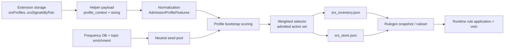

# SRS Admission / Runtime Veto Handoff

Status: checkpoint handoff
Role: boundary contract for downstream runtime veto work
Purpose: freeze the upstream admission, corpus-metadata, and user-preference contracts so runtime rule-application veto work can proceed without binding itself to unstable tuning details
Last updated: 2026-04-15
Last verified: 2026-04-15 code/doc review plus live admission review artifacts

Primary sources:
- `docs/srs/srs_profile_schema.md`
- `docs/srs/srs_set_planning_technical.md`
- `docs/srs/srs_preference_signal_admission_v1_contract.md`
- `docs/srs/srs_preference_signal_admission_design.md`
- `docs/srs/srs_preference_update_and_rebalance_policy.md`
- `core/lexishift_core/frequency/sqlite.py`
- `core/lexishift_core/srs/admission_features.py`
- `core/lexishift_core/srs/profile_bootstrap.py`
- `core/lexishift_core/srs/selector.py`
- `core/lexishift_core/helper/rulegen.py`
- `docs/test_outputs/srs_frequency_topic_coverage_latest.md`
- `docs/test_outputs/srs_admission_interest_review_en_es_metrics_latest.md`

## Current checkpoint

The current admission/preferences workstream is in a merge-safe architectural state:

- user preferences are normalized upstream
- seed generation stays neutral
- admission scoring is deterministic
- final bootstrap admission uses an explicit stochastic selector
- preview and live bootstrap now share the same scorer/selector path

What is not frozen yet is coefficient quality. Topic-aware admission is working, but tuning remains follow-up work. Downstream runtime veto work should therefore depend on the stable data boundaries below, not on current topic-lift strengths.

## One-way dataflow

Interpretation:

- admission owns everything through active-set selection
- runtime veto should treat published rulegen outputs as its stable immediate upstream surface
- runtime veto should not reach backward into raw extension preference storage unless a later contract explicitly says so

## 1. Corpus / frequency metadata contract

Canonical implementation:
- `core/lexishift_core/frequency/sqlite.py`
- `scripts/data/enrich_frequency_topics_from_sqlite.py`

Current frequency-pack contract:

- primary table: `frequency`
- required minimum seam for admission:
  - `lemma`
- optional but already used:
  - POS source columns such as `pos` / `wtype`
  - topic column `sense_topics`
- metadata lives in `meta(key="metadata")`

Current topic-enrichment contract:

- enrichment is applied upstream during frequency-pack conversion, not during runtime veto
- `sense_topics` is populated from companion dictionary SQLite data when available
- current local supported enrichment paths are strongest for:
  - `freq-ja-bccwj`
  - `freq-es-cde`
- current notable gap:
  - `freq-en-coca` still lacks comparable topic coverage

Important boundary:

- frequency topic metadata is an admission aid, not lexical truth for runtime veto
- runtime veto may inspect downstream lexical artifacts that originated from this metadata, but it should not assume:
  - topic labels are exhaustive
  - topic labels are pair-complete
  - topic labels are stable enough to be treated as hard veto criteria

## 2. User-preference schema contract

Canonical docs:
- `docs/srs/srs_profile_schema.md`
- `core/lexishift_core/srs/admission_features.py`

Current extension storage seam:

- selected profile:
  - `srsSelectedProfileId`
- profile container:
  - `srsProfiles`
- pair-local preference signals:
  - `srsProfiles.<profile_id>.srsSignalsByPair.<pair>`

Current user-editable admission signals already live:

- `interests`
- `proficiency.estimated_value`
- `difficultyPreferences.target_challenge_center`

Current helper payload seam:

- helper APIs receive `profile_id`, `pair`, and `profile_context`
- `profile_context` may include:
  - `interests`
  - `topic_weights`
  - `proficiency`
  - `difficulty_preferences`
  - `empirical_trends`
  - `source_preferences`
  - `constraints`
  - `sizing`

Current normalized helper-side contract:

- `AdmissionProfileFeatures`
  - `explicit_topic_weights`
  - `implicit_topic_weights`
  - `topic_weights`
  - `proficiency_estimate`
  - `challenge_target`
  - `challenge_spread`
  - `active_signals`
  - `missing_signals`
  - `signal_sources`

Important boundary:

- runtime veto should not consume raw extension storage as an algorithm input
- if veto work later needs user context, it should consume a helper-normalized downstream contract, not UI-local schema details
- current topic aliasing and family expansion are admission-policy implementation details, not runtime-stable veto inputs

## 3. Admission execution contract

Canonical implementation:
- `core/lexishift_core/srs/profile_bootstrap.py`
- `core/lexishift_core/srs/selector.py`
- `core/lexishift_core/helper/rulegen.py`
- `core/lexishift_core/helper/use_cases/admission_preview.py`

Current stable behavior:

- `seed.py` builds the neutral candidate frontier
- `profile_bootstrap` scores that frontier using normalized profile signals plus lexical candidate traits
- scoring remains deterministic for diagnostics and tests
- the final admitted active set is selected by explicit `weighted_without_replacement`
- preview and live bootstrap reuse that same selection policy

This means:

- scored frontier inspection is deterministic
- final active-set membership is stochastic unless a fixed seed is provided
- any downstream component should distinguish:
  - score explanation
  - actual admitted membership

Current persistence split:

- `srs/profiles/<profile_id>/srs_inventory.json`
  - pair-local active inventory membership
- `srs/profiles/<profile_id>/srs_store.json`
  - retained item history, scheduling state, and word packages
- `srs/profiles/<profile_id>/srs_rulegen_snapshot_<pair>.json`
  - helper-published snapshot/debug view
- `srs/profiles/<profile_id>/srs_ruleset_<pair>.json`
  - helper-published runtime ruleset

Important boundary:

- runtime rule application and veto should treat `srs_ruleset_<pair>.json` and the associated snapshot as the primary upstream contract
- veto logic should not need to know whether an item entered via neutral frequency or interest-biased admission

## 4. Stable seams that runtime veto can safely depend on

These are safe to build against:

- helper profile scoping by `profile_id` and `pair`
- pair-local active inventory exists separately from full retained store
- active inventory is the upstream source for helper rule publication
- rulegen consumes lexical `word_package` data attached to stored items
- preview/live admission share the same bootstrap scorer and selector semantics

These are also safe assumptions:

- preferences are upstream admission guidance, not runtime lexical truth
- tuning coefficients may change without changing the storage or publication seams
- topic coverage may improve without changing the basic profile-context schema

## 5. Inputs runtime veto should not treat as stable

The downstream veto algorithm should not bind itself to:

- raw extension keys under `srsProfiles`
- current topic alias tables in `admission_features.py`
- current `profile_bootstrap` coefficient values
- current scarcity thresholds or scarcity bonus shape
- current Monte Carlo uplift amounts in review artifacts
- preview-only explanatory text

Those are expected to evolve while the broader architecture remains the same.

## 6. Remaining work on the admission / preferences workstream

This is the explicit TODO list that should stay owned by the admission/preferences workstream after the merge checkpoint:

1. Tune topic-affinity and scarcity coefficients.
   - Current state: architecture verified, lift still modest.
2. Expand topic coverage upstream.
   - Highest gap: `freq-en-coca`
   - Current weak topics: `animals`
   - Current noisy topic: `finance`
3. Keep `profile_growth` moving from manual rebalance toward controlled continuous admission.
4. Add feedback-window aggregation and real `adaptive_refresh`.
5. Add bounded lexical-trend admission for opted-in exact-word trends.
6. Keep register/style preferences such as `slang` as a separate future axis, not topic overload.
7. Add pair-specific planner/admission policy registry instead of near-identical defaults.
8. Continue improving review artifacts and calibration reports for admitted-set distributions.

None of the above should block runtime veto work as long as veto stays on the stable downstream boundary.

## 7. What to show the other agent

If the runtime-veto agent needs one compact brief, show them this set:

- this handoff doc
- `docs/srs/srs_profile_schema.md`
- `docs/srs/srs_set_planning_technical.md`
- `docs/srs/srs_preference_signal_admission_v1_contract.md`
- `docs/test_outputs/srs_admission_interest_review_en_es_metrics_latest.md`

That gives them:

- actual upstream storage/payload contracts
- the normalized admission schema
- the deterministic-vs-stochastic boundary
- the current known limitations without hiding follow-up work
